# 🧠 Fused Multi-Branch Multi-Domain Residual Multi-Scale CNN BiLSTM Multi-Head Attention Swin Transformer for End-to-End Language Decoding from MEG: Application for BCI Systems
[](https://arxiv.org/abs/2506.02098)
[](https://arxiv.org/abs/2506.10165)
[](https://neural-processing-lab.github.io/2025-libribrain-competition/)


A Hybrid End-to-End Deep Learning Architecture for Decoding Language from Brain Activity, with Specific Applications in BCI Systems.

## 📖 Overview
This repository details the implementation of a hybrid Deep Learning (DL) architecture designed for Magnetoencephalography (MEG) signal ([LibriBrain dataset](https://arxiv.org/abs/2506.02098)) processing and decoding in the [LibriBrain Competition 2025](https://arxiv.org/abs/2506.10165), which addresses the complex challenge of mapping non-invasive brain recordings to speech events.
The model, referred to as the **Fused Multi-Path/Branch Multi-Domain (temporal/spectral/temporal-spectral, ...) Residual Multi-Scale Convolutional Neural Network (CNN) Bidirectional Long Short-Term Memory (BiLSTM) Multi-Head with Dual Attention (spatial/temporal) Swin Transformer Encoder (to extract embeddings from Time-Freq representations)**, is built for signal processing and decoding tasks with substantial societal impact on Brain-Computer Interface (BCI) systems.
The model's primary objective in the [LibriBrain Competition 2025](https://neural-processing-lab.github.io/2025-libribrain-competition/) is to decode language from MEG recordings of brain activity during a listening session, addressing core BCI tasks such as:

1) [Speech Detection](https://neural-processing-lab.github.io/2025-libribrain-competition/tracks/): speech vs. non-speech (silence) events (binary task);


2) [Phoneme Classification](https://neural-processing-lab.github.io/2025-libribrain-competition/tracks/): 39 Phonems (multi-class task).


## 📊 Challenge 2025 Leaderboard 
While the complete multi-branch architecture is actively being engineered and tuned, a subcomponent has yielded the following preliminary results at the LibriBrain Competition 2025:
1) Place 27/53 in [Speech Detection](https://neural-processing-lab.github.io/2025-libribrain-competition/leaderboard/speech_detection_standard/)
2) Place 18/30 in [Phoneme Classification](https://neural-processing-lab.github.io/2025-libribrain-competition/leaderboard/phoneme_classification_standard/)

## 🏗️ Multi-Branch Residual Multi-Scale CNN BiLSTM Multi-Head with Dual Attention Network (ResMS-CNN-BiLSTM-MH-DANet) + Time-Freq Swin Transformer Encoder Network (TF-STENet) + Filter Bank Dual-Branch Attention-based Frequency Domain Network (FB-DB-AFDNet)
The model fuses distinct, highly specialized following branches of neural networks into a unified decision framework:


### Temporal Branch: ResMS-CNN-BiLSTM-MH-DANet
This branch is designed to capture linguistic units of varying lengths.
- Multi-Scale Extraction: Utilizes parallel convolution branches with different kernel sizes.
- Dual Attention:
  - Spatial Attention: Identifies informative MEG sensors (Squeeze-and-Excitation).
  - Temporal Attention: Multi-head self-attention to focus on relevant segments.
- Long Residual Connections: Preserves gradient flow across deep layers to prevent vanishing gradients.
### Time-Frequency Branch: TF-STENet
This branch leverages Transfer Learning by treating the MEG signal as a visual problem.
- Superlets Transform: Applies Fractional Adaptive Superlet Transform (FASLT) to generate high-resolution time-frequency representations.
- Vision Transformer: Uses a pre-trained Swin Transformer V2 Tiny to extract hierarchical visual features from the spectrograms.
### Frequency Branch: FB-DB-AFDNet
- Dual-Branch Processing: Separates Real and Imaginary (or Magnitude and Phase) components of the FFT.
- Constraint Learning: Applies Orthogonality Constraints (to disentangle unique features) and Similarity Constraints between the dual branches.


## 🔬 Single-Branch Architectures
### Residual Multi-Scale CNN BiLSTM Multi-Head with Dual Attention Network (ResMS-CNN-BiLSTM-MH-DANet)
This model combines residual multi-scale CNN with BiLSTM and multi-head dual attention mechanisms:

```mermaid
graph LR
    A[MEG Input<br/>B,C,T] --> B[Spatial Attention<br/>B,C,T]
    B --> C[MS-CNN Block 1<br/>B,D₁,T]
    C --> D[MS-CNN Block 2<br/>B,D₂,T]
    D --> E[...]
    E --> F[MS-CNN Block N<br/>B,D_N,T]
    F --> G((+))
    B -.Long Residual.-> G
    G --> H[Permute<br/>B,T,D_N]
    H --> I[Layer Norm<br/>B,T,D_N]
    I --> J[Bi-LSTM<br/>B,T,D_N]
    J --> K[Temporal Attention<br/>B,T,D_N]
    K --> L[Global Avg Pool<br/>B,D_N]
    L --> M[Classifier<br/>B,1]
    M --> N[Output<br/>Speech/No-Speech]
```




#### Key Components
##### 1. **Input Processing**
- **Input Shape**: `(Batch, Channels, Time)` where:
  - `Batch`: Number of samples
  - `Channels`: Number of MEG sensors (e.g., 306 for Neuromag/Elekta systems)
  - `Time`: Temporal sequence length (e.g., 200 time points)

##### 2. **Spatial/Channel Attention Module**
- **Purpose**: Identify and focus on the most relevant MEG channels for speech detection (improves SNR)
- **Function**: Learns channel-wise importance weights/scores 
- **Output**: Weighted MEG signals emphasizing informative sensors
- **Architecture**: Uses Squeeze-and-Excitation (SE) blocks with Global Average Pooling (GAP)
- **Why it matters**: Not all MEG sensors are equally informative for speech - some are positioned over motor cortex, others over auditory cortex, etc.

##### 3. **Multi-Scale CNN Attention Module (N blocks in series)**

Each Multi-Scale CNN block contains some (here three) parallel processing scales with different temporal receptive fields (kernel sizes):

###### Scale Structure (per block):
```
Scale 1 (K=5):  Conv1d(kernel=5)  → BatchNorm1d → GELU
Scale 2 (K=13): Conv1d(kernel=13) → BatchNorm1d → GELU  
Scale 3 (K=25): Conv1d(kernel=25) → BatchNorm1d → GELU
```

###### Multi-Scale Design Rationale:
- **K=5** (~20ms): Captures **phonetic features** - short-term acoustic patterns
- **K=13** (~52ms): Captures **syllabic patterns** - medium-term linguistic units
- **K=25** (~100ms): Captures **prosodic information** - longer-term intonation patterns

###### Processing Flow:
1. **Parallel Processing**: Input is processed simultaneously through all three scales
2. **Concatenation**: Scale outputs are concatenated along the channel dimension:
   - `[B, D/3, T] + [B, D/3, T] + [B, D/3, T] → [B, D, T]`
3. **Dropout Regularization**: Applied after concatenation (rate = 0.15 for CNN layers)
4. **Output**: Multi-scale feature representation flows to the next block

###### Progressive Dimension Expansion:
Blocks progressively expand feature dimensions:
```
Block 1: D₁ = model_dim / 2^(N-1)
Block 2: D₂ = model_dim / 2^(N-2)
...
Block N: D_N = model_dim
```

For example, with `model_dim=128` and `N=3`:
- Block 1: 32 dimensions
- Block 2: 64 dimensions  
- Block 3: 128 dimensions

##### 4. **Long Residual Connection**

A critical skip connection that:
- **Starts**: After Spatial Attention output
- **Ends**: At the addition operation after Block N
- **Purpose**: 
  - Preserves gradient flow during backpropagation
  - Training Stabilization: Enables deeper networks without vanishing gradients
  - Maintains direct path for information from input to deep layers
- **Adaptive Projection**: If dimensions mismatch, a 1×1 convolution projects the residual to match

##### 5. **Reshape & Normalization**
- **Permute**: Transforms from CNN format `(B, C, T)` to RNN format `(B, T, C)`
- **Layer Normalization**: Stabilizes activations before temporal processing

##### 6. **Temporal Processing Pipeline**
###### Bidirectional LSTM
- **Purpose**: Model temporal sequential dependencies in both forward and backward directions
- **Architecture**: 
  - Multiple stacked layers (typically 2-3)
  - Hidden size: `D_N/2` per direction (total output: `D_N`)
  - Dropout between layers for regularization
- **Why bidirectional**: Speech context flows both ways - future phonemes influence current perception
  
###### Temporal Attention (Multi-head Self-Attention)
- **Purpose**: Learn which time steps are most important for classification
- **Configuration**: 8 attention heads
- **Mechanism**: Computes attention weights across the time dimension
- **Benefit**: Adaptively focuses on informative temporal segments (e.g., speech onset, vowels)

###### Global Average Pooling
- **Function**: Converts `(B, T, D_N)` to `(B, D_N)`
- **Advantage**: More robust
- **Operation**: `output = mean(sequence, dim=time)`

##### 7. **Multi-layer Decision Network (Classifier)**
A Fully Connected (FC) network with progressive dimension reduction, non-linearity, and regularization (to prevent overfitting):
```
Input (B, D_N)
    ↓
Linear(D_N → D_N/2) + Dropout(0.3)
    ↓
GELU activation
    ↓
Dropout(0.15)
    ↓
Linear(D_N/2 → 1)
    ↓
Output (B, 1) - Single logit for binary classification
```

##### 8. **Output**
- **Binary Classification**: Speech vs No-Speech
- **Format**: Single logit per sample (apply sigmoid for probability)
  
### Time-Freq Swin Transformer Encoder Network (TF-STENet)
This model architecture combines adaptive time-frequency representations with pre-trained vision transformer encoders:

```mermaid
graph LR
    A[MEG Signals<br/>B, C, T] --> B[Superlets Transform<br/>FASLT 0.5-30 Hz]
    B --> C[Power Spectrogram<br/>B, C, F, T]
    C --> D[RGB Conversion<br/>B×C, 3, 256, 256]
    D --> E[Swin V2 Encoder<br/>Frozen Backbone]
    E --> F[Visual Features<br/>B×C, 768]
    F --> G[Feature Projection<br/>768 → 256 → 128]
    G --> H[Projected Features<br/>B×C, 128]
    H --> I[Channel Aggregation<br/>Average Pooling]
    I --> J[Unified Embedding<br/>B, 128]
    J --> K[Classification Head<br/>Dropout + FC Layers]
    K --> L[Output Logits<br/>B, 1]
    L --> M[Speech / No-Speech<br/>Binary Prediction]
```




#### Key Components
##### 1. **Spectrogram**
Converts raw MEG signals into adaptive time-frequency representations using Superlets, which applies the Fractional Adaptive Superlet Transform (FASLT).
###### Key Features
- **Frequency range**: 0.5-30 Hz (covering delta, theta, alpha, and beta bands)
- **Adaptive resolution**: Low frequencies (0.5-8 Hz) use high frequency resolution to capture slow oscillations, while high frequencies (8-30 Hz) use high temporal resolution for fast dynamics
- **Multi-order analysis**: Orders 1-16 provide multi-scale spectral decomposition
- **Output**: Log-power spectrograms preserving both spatial (channel) and spectral information

##### 2. **Pre-Trained Swin Transformer Encoder**
The model leverages a pretrained Swin Transformer V2 (Tiny variant) originally trained on ImageNet-1K to process MEG spectrograms as visual data to extracts hierarchical visual features from spectrograms using transfer learning.
###### Key Features
- **Frozen backbone**: The Swin V2 model weights remain fixed, utilizing learned visual representations
- **Input preprocessing**: Grayscale spectrograms are converted to RGB format (256×256 pixels)
- **Feature extraction**: Produces 768-dimensional embeddings per channel
- **Trainable projection**: Maps 768 → 256 → 128 dimensions with GELU activation and dropout (0.1)
- **Channel aggregation**: Average pooling across all MEG sensors produces a unified 128-dimensional representation
  
### Filter Bank Dual-Branch Attention-based Frequency Domain Network ([FB-DB-AFDNet](https://ieeexplore.ieee.org/document/11231326))
This model architecture incorporates a filter bank approach to process multiple frequency subbands, using DB-AFDNets, in parallel.
The DB-AFDNet processes complex frequency-domain representations of neural signals, obtained using FFT Transform, through a dual-branch framework, treating the real and imaginary (or magnitude and phase) components separately in different branches, rather than concatenating them in a single branch.
The DB-AFDNet uses inter-branch attentional similarity, intra-branch orthogonality, and attention (spatial and multi-scale adaptive) modules to extract shared and unique features of the spectral components and assigns spatial and temporal attention:


#### FB-DB-AFDNet

```mermaid
graph LR
    A[Raw MEG Signals<br/>Multi-channel Time Series] --> B[Filter Bank Decomposition]
    
    B --> C1[Subband 1<br/>f₁-f₂ Hz]
    B --> C2[Subband 2<br/>f₃-f₄ Hz]
    B --> C3[...]
    B --> CN[Subband N<br/>fₙ₋₁-fₙ Hz]
    
    C1 --> D1[DB-AFDNet 1<br/>Subnetwork]
    C2 --> D2[DB-AFDNet 2<br/>Subnetwork]
    C3 --> D3[...]
    CN --> DN[DB-AFDNet N<br/>Subnetwork]
    
    D1 --> F[Fusion]
    D2 --> F
    D3 --> F
    DN --> F
    
    F --> G[Multi-layer Decision Network<br/>FC + Dropout + LayerNorm]
```

#### DB-AFDNet


#### Key Components
##### 1. **Attention**
- Adaptively focuses on spatially and spectrally important features
- **Channel-wise Attention**: Recalibrates multi-channel data to improve signal-to-noise ratio by learning spatial/channel importance weights/scores
- **Multi-scale Adaptive Attention**: Captures frequency responses across multiple scales using grouped convolutions with varying kernel sizes (receptive fields)

##### 2. **Dual-branch Architecture**
- Effectively utilizes both real and imaginary (or magnitude and phase) components of frequency representations
  
##### 3. **Representation Constraint Learning**
- **Similarity Constraint**: Enforces consistency between branches to learn shared features.
- **Orthogonality Constraint**: Disentangles shared (inter-branch) and unique (branch-specific) information within each branch.

##### 4. **Filter Bank Extension**
- **Multi-band Processing**: Captures frequency-specific neural patterns across different brain rhythms by applying multiple DB-AFDNet subnetworks to different frequency subbands.
  
## Performance Monitoring 
Performance logs on [Weights & Biases](https://wandb.ai/fardinafdideh-ki/projects) (an AI developer platform):

### [Speech Detection (Binary)](https://wandb.ai/fardinafdideh-ki/libribrain-experiments/workspace?nw=nwuserfardinafdideh)


### [Phoneme Classification (39-Class)](https://wandb.ai/fardinafdideh-ki/libribrain-phoneme-trainTestWithVal_ChannelSpatialAttentionReductionKernelSize/workspace?nw=nwuserfardinafdideh)


  
## Dimension Tracking Example
### Residual Multi-Scale CNN BiLSTM Multi-Head with Dual Attention Network (ResMS-CNN-BiLSTM-MH-DANet)
With `B=32, C=306, T=200, model_dim=128, N=3`:

```
MEG Input:           [32, 306, 200]
Spatial Attention:   [32, 306, 200]
CNN Block 1:         [32, 32, 200]    # D₁ = 128/4 = 32
CNN Block 2:         [32, 64, 200]    # D₂ = 128/2 = 64
CNN Block 3:         [32, 128, 200]   # D₃ = 128
Residual Added:      [32, 128, 200]
Permuted:            [32, 200, 128]
Bi-LSTM:             [32, 200, 128]
Temporal Attention:  [32, 200, 128]
Global Pooled:       [32, 128]
Classifier Layer 1:  [32, 64]
Final Output:        [32, 1]
```

## Design Principles

### 1. **Multi-Scale Feature Extraction**
Inspired by [EEGNet](https://arxiv.org/abs/1611.08024) and recent MEG research, parallel convolutions with different kernel sizes capture neural patterns at multiple temporal scales simultaneously.

### 2. **Attention Mechanisms**
- **Spatial**: Focus on relevant brain regions
- **Temporal**: Focus on important time points
- Both improve interpretability and performance

### 3. **Residual Learning**
Long skip connections enable:
- Deeper networks (prevents vanishing gradients)
- Faster convergence
- Better gradient flow

### 4. **Regularization Strategy**
- **Dropout**: Higher rates (0.3) in classifier, lower (0.15) in feature extractors
- **Batch Normalization**: After each convolution
- **Layer Normalization**: Before recurrent processing
- **Weight Initialization**: Xavier for linear, Kaiming for conv, Orthogonal for LSTM

### 5. **Activation Functions**
- **GELU**: Preferred over ReLU for neural signal processing (smoother, better for small signals)

### 6. **Adaptive time-frequency analysis**
- [Superlets](https://www.nature.com/articles/s41467-020-20539-9) provide optimal resolution across different frequency bands relevant to neural processing

### 7. **Transfer Learning Strategy**
- Leveraging powerful visual feature extractors trained on large-scale image datasets (pretrained vision transformers) reduces training requirements and improves generalization
- Adapt efficiently to MEG data with limited training samples
- Capture complex spatiotemporal patterns in neural signals

## Hyperparameters

| Parameter | Default | Range | Description |
|-----------|---------|-------|-------------|
| `input_dim` | 306 | - | Number of MEG channels |
| `model_dim` | 128 | 64-256 | Hidden dimension size |
| `dropout_rate` | 0.3 | 0.2-0.5 | Dropout probability |
| `lstm_layers` | 2 | 2-3 | Number of LSTM layers |
| `cnn_layers` | 3 | 3-6 | Number of MS-CNN blocks (N) |
| `kernel_sizes` | [5,13,25] | [[5,25], [5,13,25]] | Multi-scale kernel sizes |
| `use_attention` | True | [True, False] | Enable spatial attention |
| `use_residual` | True | [True, False] | Enable residual connections |
| `bi_directional` | True | [True, False] | Bidirectional LSTM |
| `smoothing` | 0.1 | - | Label smoothing |

## Training Considerations

### Loss Function
Binary Cross-Entropy (BCE) for speech/no-speech classification

### Optimizer
Adam optimizer recommended with:
- Learning rate: 1e-3 to 1e-4
- Weight decay: 1e-5 to 1e-2

### Learning Rate Schedule
- Warmup for first 5-10% of training
- Cosine annealing or ReduceLROnPlateau

### Data Augmentation (MEG-specific)
- Temporal cropping/shifting
- Channel dropout
- Gaussian noise injection
- Time warping

## Performance Tips
1. **Batch Size**: Start with 32-64, increase if memory permits
2. **Gradient Clipping**: Use value of 1.0 to prevent exploding gradients
3. **Mixed Precision**: Use FP16 training for speed (careful with numerical stability)
4. **Preprocessing**: 
   - Bandpass filter MEG signals (e.g., 0.5-40 Hz)
   - Z-score normalization per channel
   - Remove bad channels/sensors

## References
- [LibriBrain Competition 2025](https://neural-processing-lab.github.io/2025-libribrain-competition/)
  - [LibriBrain: Over 50 Hours of Within-Subject MEG to Improve Speech Decoding Methods at Scale](https://arxiv.org/abs/2506.02098)
  - [The 2025 PNPL Competition: Speech Detection and Phoneme Classification in the LibriBrain Dataset](https://arxiv.org/abs/2506.10165)
- [EEGNet](https://arxiv.org/abs/1611.08024)
- [Attention is All You Need](https://arxiv.org/abs/1706.03762)
- [Deep Residual Learning](https://arxiv.org/abs/1512.03385)
- [Time-frequency super-resolution with superlets](https://www.nature.com/articles/s41467-020-20539-9)
- [Filter Bank Dual-Branch Attention-based Frequency Domain Network (FB-DB-AFDNet)](https://ieeexplore.ieee.org/document/11231326)

## 📚 How to cite
* **F. Afdideh**, et al., “Fused Multi-Branch Multi-Domain Residual Multi-Scale CNN BiLSTM Multi-Head Attention Swin Transformer for Language Decoding from MEG: Application for BCI Systems,” *[in preparation](https://github.com/fardinafdideh/LibriBrain)*.
